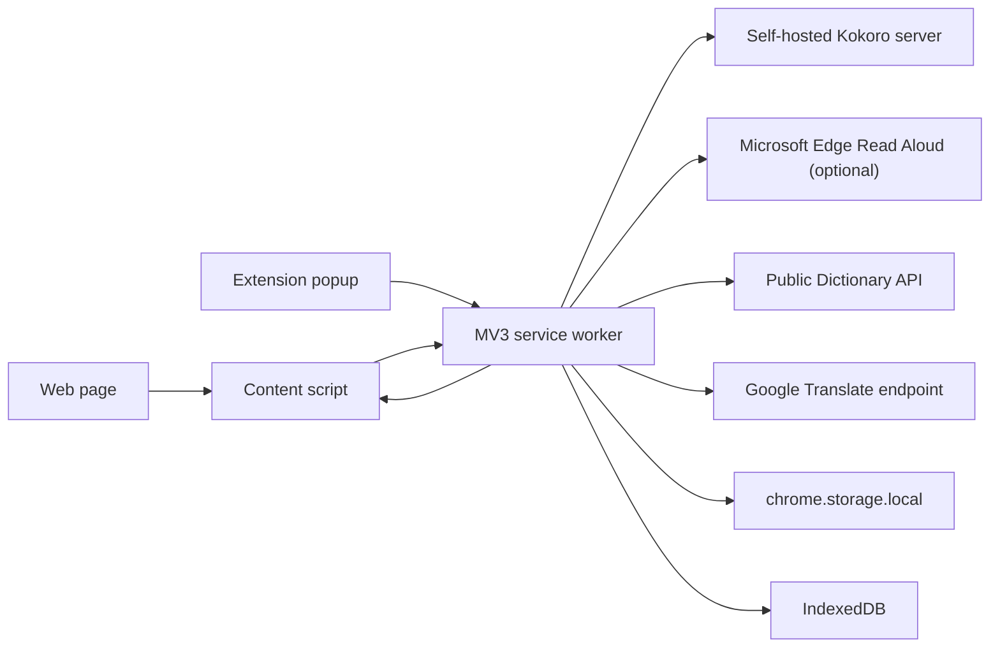
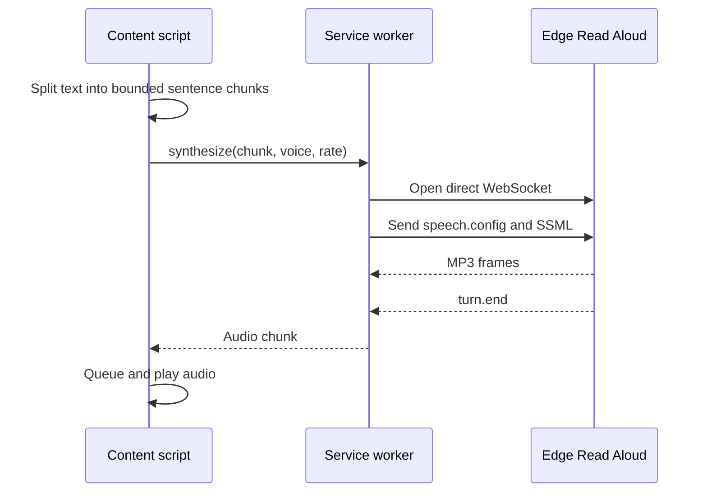
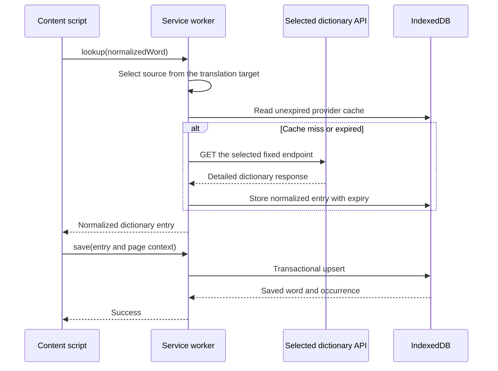

# Architecture

## Origin

This architecture is the target state of a migration from an earlier,
backend-backed version of EchoRead, whose frontend modules were ported and
adapted to the boundaries below. That history explains why the boundaries fall
where they do — the diagrams describe where existing behavior landed after the
backend was removed, rather than a clean-room design. The predecessor is not
public, and nothing here depends on it.

## System Overview

The system consists only of a Chrome extension. It has no EchoRead-owned backend.



## Runtime Responsibilities

### Content Script

The content script interacts with web pages:

- Extract main content and selected text.
- Detect Alt+click sentences, Shift+click paragraphs, and Ctrl+click words.
- Display a lightweight reading controller.
- Display a selection toolbar and dictionary card.
- Play audio chunks returned by the service worker.
- Send dictionary, vocabulary, and settings requests to the service worker.
- Display direct translations for selected or actively read sentences.
- Detect the language of the page's text and resolve which stored voice reads
  it, until the reader chooses a language themselves.

The content script does not access persistent storage directly and contains no
speech transport implementation. It never learns which engine is selected: it
sends a voice and a rate, and the service worker resolves the engine and host.

### Extension Popup

The popup provides extension-level controls:

- Start reading the current page.
- Change voice and playback speed.
- View, search, and delete local vocabulary.
- Import and export user data.
- Display database usage and external service status.

### MV3 Service Worker

The service worker is the application coordinator, not a network server:

- Resolve the stored speech engine and its host for every playback request.
- Call the self-hosted Kokoro captioned-speech route over HTTP, or establish an
  Edge Read Aloud WebSocket connection when that engine is selected.
- Parse MP3 frames and word timings into one provider-neutral contract.
- Call the fixed public dictionary endpoint and normalize responses.
- Call the fixed translation endpoint through a validated text-only contract.
- Manage local vocabulary through repository interfaces.
- Validate every message received from extension contexts.
- Apply consistent timeout, cancellation, and error handling.

The minimum Chrome version should be at least 116 to use the improved service
worker lifetime behavior for active WebSocket connections.

## Proposed Module Boundaries

```text
src/
  background/
    index.ts
    message-router.ts
  content/
    index.ts
    reader-controller.ts
    selection-controller.ts
    dictionary-card.ts
  popup/
    index.html
    main.ts
  providers/
    tts-provider.ts
    kokoro-tts-provider.ts
    kokoro-voice-list-provider.ts
    edge-tts-provider.ts
    dictionary-provider.ts
    free-dictionary-provider.ts
  storage/
    vocabulary-repository.ts
    indexeddb-vocabulary-repository.ts
    settings-repository.ts
    database.ts
    migrations.ts
  shared/
    messages.ts
    types.ts
    validation.ts
```

The UI depends on Provider and Repository interfaces, not concrete endpoints or
browser storage implementations.

## Edge TTS Data Flow



A Declarative Net Request rule modifies the target WebSocket `User-Agent` and
`Origin`. The rule must:

- Match only `speech.platform.bing.com`.
- Match only the `websocket` resource type.
- Never modify ordinary page requests.

The direct Provider requests WordBoundary metadata for the retained single-color
active-word reading highlight. The offscreen runtime owns the audio clock and
emits a sentence-local word index only when that index changes; content maps the
index back to a non-destructive DOM Range. Pronunciation scores and multi-color
assessment layers remain outside the product scope.

## Long-Text Strategy

- Split text at sentence-ending punctuation.
- Target chunks of approximately 250 to 500 characters.
- Split punctuation-free runs at whitespace or a hard length boundary.
- Prefetch only the next chunk while the current chunk plays.
- Stop submitting requests immediately after the user stops playback.
- Discard results from requests that completed after cancellation.
- Apply connection and synthesis timeouts to every chunk.

## Dictionary and Vocabulary Data Flow



Two Dictionary Providers are wired behind one lookup message, and the reader's
translation target chooses between them: a Chinese target uses Youdao's fixed
public JSON endpoint for English-Chinese entries, and every other target uses
the Free Dictionary endpoint for monolingual English entries. A bilingual source
is only useful to a reader who reads its second language, so the setting that
already states which language the reader reads also states which source can
serve them. The response names the source that answered so the card can
attribute it.

Both Providers share one IndexedDB cache. Each cache key carries the provider
name and its definition language, so switching targets reads that source's own
entries instead of the other source's. UI and message contracts use only the
internal normalized dictionary type. The service worker keeps the legacy
cache-first lookup behavior but stores responses locally in IndexedDB instead of
the former backend database.

## Storage Boundaries

- `chrome.storage.local` stores small settings and database metadata.
- IndexedDB stores vocabulary, word occurrences, and dictionary cache entries.
- Cache Storage may store optional TTS audio in a later release.
- Content scripts access storage only through validated messages.
- Database writes are centralized in the service worker.

## Security Boundaries

- Every message uses a fixed action allowlist and runtime validation.
- A content script cannot ask the service worker to fetch an arbitrary URL.
- Dictionary requests can access only the two configured dictionary hosts.
- Translation requests can access only the configured translation host.
- Edge requests can access only the configured Microsoft host.
- The Kokoro host is normalized to a plain HTTP origin before it is stored, and
  re-validated at the runtime boundary before it becomes a fetch URL.
- Page-derived content is rendered with `textContent`, not untrusted `innerHTML`.
- IndexedDB is opened only from trusted extension contexts.
- The extension stores no API keys, login tokens, or user credentials.

## External Failure Strategy

### Kokoro TTS

- Server unreachable: report a connection failure naming the configured address
  instead of silently falling back to another engine.
- Voice list unavailable: fall back to the shipped catalog so settings stay usable.
- Malformed stream: surface a protocol error and stop the sentence.

### Edge TTS

- Handshake failure: display `Edge TTS is currently unavailable`.
- Timeout: allow the user to retry the current chunk.
- Repeated failure: stop reading instead of creating an infinite retry loop.
- Protocol change: update the Provider without changing the player or UI.

### Dictionary API

- HTTP 404: display a word-not-found state.
- A source that has no entry for a word does not fall through to the other
  source, because that would answer in a language the reader did not ask for.
- HTTP 429 or 5xx: display a temporary failure with a retry action.
- Previously saved definitions remain available from IndexedDB while offline.

### Translation

- Invalid text or language codes: reject the message before network access.
- Network or response failure: keep the reading session active and show an error.
- Translation results remain an in-memory convenience cache, not user records.

## Build Direction

Use TypeScript and Vite with minimal dependencies. A small UI framework is
optional, but application state, Provider contracts, and Repository contracts
must remain framework-independent.
