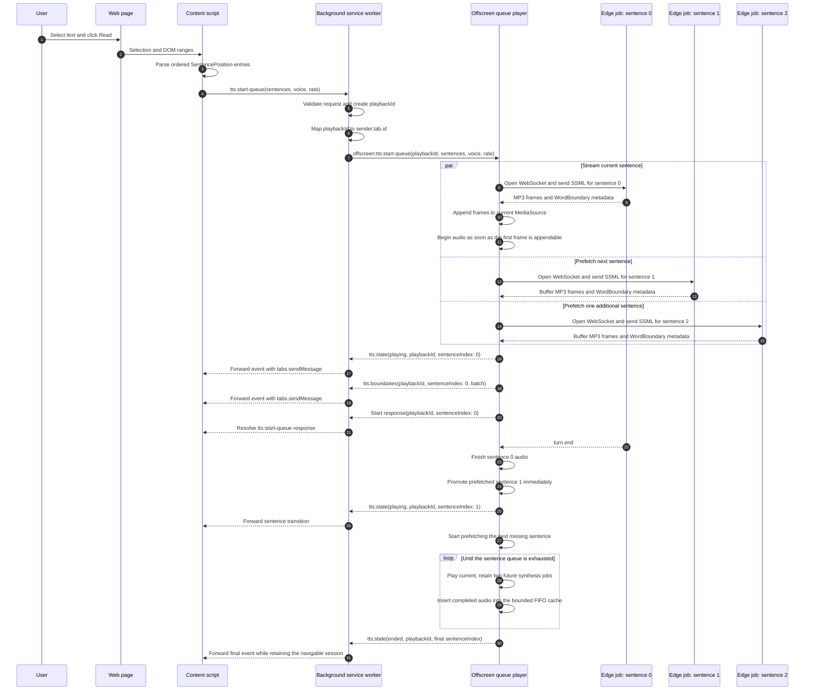

# TTS Data Flow

## Purpose and Status

This document describes the complete selected-text speech path from a web page
to Microsoft Edge Read Aloud and back to the originating content script.

The implemented design is a stateful sentence playback session with a bounded
audio cache and a two-sentence look-ahead window. As of July 15, 2026, queue
routing, offscreen playback, non-invasive page interaction, sentence Range
highlighting, and idle-runtime recovery are connected in the production path. Chrome may discard
an `AUDIO_PLAYBACK` offscreen document after an idle period; the content script
then recreates the same logical queue with a new playback ID and a validated
`startIndex` so playback resumes at the retained sentence.

## Runtime Boundaries

| Runtime | Primary responsibility | Must not do |
| --- | --- | --- |
| Web page | Owns the document and browser selection | Access extension internals |
| Content script | Captures and segments selected text, owns reader UI and page-facing state | Open Edge WebSockets or own audio playback |
| Background service worker | Validates messages, creates playback IDs, owns tab routing, and ensures the offscreen document exists | Decode or play audio |
| Offscreen document | Owns the playback session, Edge synthesis jobs, audio cache, MediaSource, and HTMLAudioElement | Access page DOM or persistent application state |
| Edge TTS Provider | Encapsulates the direct Edge Read Aloud WebSocket protocol | Know about tabs, UI, or Chrome message routing |

The content script and offscreen document cannot communicate directly. The
background service worker is the trusted bridge in both directions.

## Target Queue Data Flow



## Step-by-Step Processing

### 1. Selection Capture in the Content Script

`SelectionToolbar` captures a stable `SelectionInfo` before its button click can
collapse the browser selection. `selection-handler.ts` converts the selected DOM
text into ordered `SentencePosition` values:

```ts
interface SentencePosition {
  id: string
  index: number
  start: number
  end: number
  text: string
  range: Range | null
}
```

The opaque ID is stable only within the current content-side reading session.
It identifies hover, click, and painted-highlight state even when repeated
sentences contain identical text. The ordered index is the shared reference used
by offscreen messages. Absolute offsets and DOM Ranges stay in the content
script; only normalized sentence text crosses the queue-start boundary.

A minimized port of the legacy character-position index traverses the selection's
common DOM root and inserts a synthetic newline whenever the nearest block
element changes. The same coordinate space is used to split sentences and create
their DOM Ranges. This keeps later sentences aligned across `li`, `p`, heading,
table-cell, and other block boundaries even though browser selection text adds
separators that are absent from adjacent Text nodes. Each content-local
`SentencePosition` retains its precomputed Range; that Range is not serialized to
background or offscreen runtimes.

The retained `public/highlight-worklet.js` uses the CSS Houdini Paint API to
paint Range rectangles through element custom properties. It does not wrap page
text in spans. A minimized port of the legacy highlight manager owns this
preferred path and retains its absolutely positioned overlay as the fallback.

The selection action is a compact 20-pixel speaker button positioned four pixels
after the right edge of the selected text's final rendered line and vertically
centered with that line. It falls back to the left side only when the viewport
has no room after the text.

### 2. Public Queue Request

The content TTS controller sends one request for the entire reading session:

```ts
{
  action: 'tts:start-queue',
  sentences: [
    'API endpoints facilitate communication between clients and servers.',
    'We will design the APIs REST-style.',
    'A URL shortener primarily needs two API endpoints.'
  ],
  voice: 'en-US-AriaNeural',
  rate: 1
}
```

This is one playback session, not three independent content requests. Each
sentence remains a separate Edge synthesis unit so its timestamps start at zero
and its page range remains unambiguous.

### 3. Background Validation and Ownership

The background service worker accepts only allowlisted, runtime-validated
messages from the installed extension. For a valid queue start it:

1. Ensures `/offscreen.html` exists.
2. Generates a non-page-controlled `playbackId` with `crypto.randomUUID()`.
3. Stores `playbackId -> sender.tab.id` when the request came from content.
4. Converts the public request to `offscreen:tts:start-queue`.
5. Sends the private request to the offscreen document.

The page can choose text, voice, and rate. It cannot choose a network endpoint,
offscreen URL, WebSocket parameter, or event destination.

Popup playback may use the existing single-text `tts:start` request. Queue and
single-text starts share pause, resume, and stop commands.

### 4. Offscreen Playback Session

The offscreen document maintains one active primary `PlaybackSession`. The
sentence list is the durable navigation model for that session. Audio is a
replaceable cache attached to sentence entries, not the queue itself.

Loading the document and starting a session both start a looping inaudible
primer, which stops shortly after the sentence becomes audible. Chrome opens an
output stream when a media element starts playing, and the media clock advances
from the moment Chrome begins feeding it while the audio server still needs time
to start consuming. That cost is paid per stream, so a sentence that opened its
own stream lost its opening words. Overlapping the primer with the sentence
means the sentence joins a mixer that is already running.

Its target state is conceptually:

```ts
type SessionState =
  | 'idle'
  | 'synthesizing'
  | 'playing'
  | 'paused'
  | 'stopped'
  | 'ended'
  | 'error'

type SentenceState =
  | 'waiting'
  | 'synthesizing'
  | 'ready'
  | 'playing'
  | 'paused'
  | 'played'
  | 'failed'
  | 'evicted'

interface PlaybackSession {
  playbackId: string
  sentences: SentenceEntry[]
  currentIndex: number
  state: SessionState
  operationVersion: number
  synthesisJobs: Map<string, SynthesisJob>
  audio: HTMLAudioElement | null
  mediaSource: MediaSource | null
  cache: SentenceAudioCache
}

interface SynthesisJob {
  cacheKey: string
  sentenceIndexes: Set<number>
  abortController: AbortController
  chunks: Uint8Array[]
  wordBoundaries: WordBoundary[]
  byteLength: number
  promise: Promise<void>
}

interface SentenceEntry {
  index: number
  text: string
  cacheKey: string
  state: SentenceState
  error: TtsRuntimeError | null
}

interface CachedSentenceAudio {
  cacheKey: string
  text: string
  voice: string
  rate: number
  contentType: 'audio/mpeg'
  chunks: Uint8Array[]
  byteLength: number
  wordBoundaries: WordBoundary[]
  insertedAt: number
}

interface SentenceAudioCache {
  entries: Map<string, CachedSentenceAudio>
  totalBytes: number
  maxEntries: number
  maxBytes: number
}
```

The sentence list is never shortened by audio eviction. If sentence 12 loses its
cache entry, its `SentenceEntry` remains at index 12 with state `evicted`;
selecting it again simply starts or joins a synthesis job for its `cacheKey`.
Repeated sentences may share one cache entry and one in-flight synthesis job.

The look-ahead window contains the current sentence plus two future sentences.
For example, while index 4 is playing, indices 5 and 6 may synthesize in
parallel. Index 7 remains `waiting` until index 4 finishes and the window moves.

The window is bounded because unrestricted prefetch would create unnecessary
WebSockets and retain the complete selected page as MP3 bytes in memory.

### 5. Playback Actions and Navigation

The content controller operates on the existing session and stable
`playbackId`. It does not submit a new queue when the user navigates.

| Action | Session behavior |
| --- | --- |
| Play or resume | Plays the current sentence from its paused position; synthesizes it first on a cache miss |
| Pause | Pauses the current audio position; completed prefetch jobs may still enter the cache |
| Stop | Stops current audio, resets its position to zero, cancels unfinished synthesis, and retains the sentence list and completed cache entries |
| Previous | Stops the current audio, decrements `currentIndex`, then plays the cached previous sentence or synthesizes it again |
| Next | Stops the current audio, increments `currentIndex`, then promotes cached or prefetched audio |
| Play sentence | Stops the current audio, selects the validated `sentenceIndex`, and plays cached, in-flight, or newly synthesized audio |
| Dispose | Permanently aborts the session, clears its cache, releases media objects, and removes background ownership |

`Previous` and `Next` clamp to the valid sentence range. A sentence transition
increments an internal operation version so a late result from the abandoned
sentence cannot take over the audio element.

The target public control actions are `tts:pause`, `tts:resume`, `tts:stop`,
`tts:previous`, `tts:next`, `tts:play-sentence`, and `tts:dispose`. The targeted
action carries a non-negative integer `sentenceIndex`; offscreen additionally
checks that it is inside the active queue. The background maps every action to a
fixed offscreen action and never accepts a caller-provided target.

### 5.1 Page Sentence Interaction

The content script retains the legacy click-to-listen behavior for every sentence
in the active queue:

- Hovering a queued sentence paints the hover Range and changes the underlying
  page element cursor to `pointer`.
- Clicking the currently playing sentence pauses it.
- Clicking the current paused sentence resumes it.
- Clicking any other queued sentence sends one `tts:play-sentence` command. The
  offscreen session invalidates the previous operation, stops its audio, and
  promotes the requested sentence.
- A `playing` event maps its `sentenceIndex` back to the stable content sentence
  ID, clears the previous playing highlight, and paints the new Range.
- Stopped and ended sessions retain IDs, Ranges, and click handling. Dispose or
  session replacement releases those content-side references.

### 5.2 Active Word Highlighting

The offscreen document owns the only audio clock. While audio is playing, it
compares `HTMLAudioElement.currentTime` with the current sentence's ordered
WordBoundary list. It sends `tts:word` only when the sentence-local word index
changes; it does not broadcast every animation frame or expose the audio element
to content.

Content stores the active word index behind the playback ID and sentence index
gates. A minimized port of the legacy sequential word matcher maps each boundary
to the matching portion of the sentence Range across nested text nodes. The
single-color word layer is painted above the sentence layer without wrapping or
rewriting page text. Pause retains the current word highlight; sentence changes,
stop, end, replacement, and dispose clear it.

### 5.3 Non-Invasive Session Actions

The content script does not render a persistent playback toolbar over the page.
Sentence clicks provide pause, resume, and targeted navigation. A compact
18-pixel exit icon is positioned with its left edge four pixels after the final
sentence Range in the active queue, so the control never extends backward over
the sentence. Hover or keyboard focus reveals a small action menu below it.

Clicking the default icon exits reading. The menu also opens translation for the
retained queue. Hovering a translated sentence highlights its corresponding page
Range, while clicking it applies the same start, pause, resume, or sentence-switch
behavior as clicking the source sentence. Exit sends a best-effort `tts:dispose`,
then immediately clears the local playback ID, retained page Ranges, and all
highlight layers. Local cleanup still completes if Chrome has already discarded
the remote runtime.

Source and translated sentences share one transient hover index while the panel
is open. Moving across either side highlights the mapped sentence on the other
side, including selected-text translation before a playback session has started.

### 6. Direct Edge Read Aloud Synthesis

Each sentence job calls `EdgeTtsProvider.synthesizeStream()` independently. The
Provider:

1. Validates text length, voice format, and playback rate.
2. Generates the public Edge protocol validation URL parameters.
3. Opens the fixed `speech.platform.bing.com` WebSocket endpoint.
4. Sends `speech.config` with MP3 output and WordBoundary metadata enabled.
5. Sends escaped SSML containing exactly one sentence.
6. Emits MP3 payloads as binary frames arrive.
7. Emits normalized word timestamps in seconds.
8. Resolves the sentence job after `turn.end`.

The current sentence forwards incoming MP3 frames to MediaSource immediately.
Future sentences retain their frames in their `SentenceJob` buffers. A future
sentence may be promoted before synthesis completes; in that case, already
buffered frames start playback and later frames continue appending to its
MediaSource.

### 7. Sentence Promotion

When the current audio ends, the queue player does not create a new content or
background request. It:

1. Releases only the completed sentence's media objects.
2. Increments `currentIndex`.
3. Promotes the next prefetched job.
4. Starts its buffered or still-streaming MP3 data immediately.
5. Publishes a `playing` event with the new `sentenceIndex`.
6. Extends the look-ahead window by starting one new synthesis job.
7. Inserts completed encoded audio and timestamps into the FIFO cache.

The remaining audible gap is the voice's natural sentence pause plus local audio
promotion overhead. It does not include a new content-to-background round trip,
offscreen creation check, Edge connection startup, or wait for the first network
audio frame.

### 8. Audio Cache and FIFO Eviction

The first implementation uses an in-memory offscreen cache. It survives content
UI rerenders and service-worker suspension, but not extension reload, browser
restart, or Chrome destroying the offscreen document. Persistent audio caching
is a separate future storage feature.

The cache is bounded by both entry count and encoded byte size. Both values are
configuration fields rather than hard-coded eviction assumptions. A practical
initial default is 100 audio entries and 64 MiB, with eviction triggered when
either limit is exceeded. Setting a lower entry count supports constrained
devices, while the byte limit prevents a small number of unusually long
sentences from consuming excessive memory.

The cache is content-addressed:

```ts
type AudioCacheKey = string

const audioCache = new Map<AudioCacheKey, CachedSentenceAudio>()
```

`AudioCacheKey` is the lowercase hexadecimal SHA-256 digest of a canonical UTF-8
payload containing every input that can change the encoded result:

```text
echo-read-edge-tts-cache-v1\0
edge-read-aloud\0
audio-24khz-48kbitrate-mono-mp3\0
<voice-id>\0
<canonical-rate>\0
<trimmed-sentence-text>
```

SHA-256 is available through `crypto.subtle.digest('SHA-256', data)` in extension
contexts. MD5 is unnecessary here and is not provided by Web Crypto. A random
UUID is also unsuitable because the same synthesis inputs must deterministically
produce the same key for a cache lookup.

No finite hash is mathematically collision-free. SHA-256 makes an accidental
collision negligible, and the cache still verifies the stored text, voice,
rate, content type, and cache version after a hash hit. A mismatched fingerprint
is treated as a cache miss.

The version, Provider, and output format fields deliberately invalidate old
entries when synthesis behavior or encoding changes. The rate uses one stable
numeric serialization. The text is transformed exactly as the Provider
transforms it before SSML generation, currently `text.trim()`, so hashing and
synthesis cannot disagree about the input.

JavaScript `Map` preserves insertion order, so the map itself supplies FIFO
ordering without a second queue that could drift out of sync:

1. Insert a fully synthesized entry with `entries.set(cacheKey, audio)`.
2. Increase `totalBytes` by its encoded MP3 byte length.
3. A cache hit uses `entries.get(cacheKey)` without deleting and reinserting it;
   therefore a read does not change FIFO order.
4. While `entries.size > maxEntries` or `totalBytes > maxBytes`, scan Map keys
   from the oldest insertion.
5. Never evict the current playing entry or an entry whose bytes are being
   appended to MediaSource. Skip it temporarily and inspect the next candidate.
6. Delete the oldest eligible key, subtract its bytes, and mark every sentence
   referencing that key as `evicted` unless another synthesis job is active.

An eviction pass inspects each cached entry at most once. If every entry is
temporarily protected, it stops and prevents additional prefetch work until
bytes become eligible; it must never loop indefinitely.

A cache hit does not change insertion order. That property makes this FIFO,
not LRU. Replaying an old cached sentence therefore does not make it newer. If
navigation behavior later shows that frequently replayed sentences should stay
resident, the policy can be replaced behind the same cache interface.

Changing text, voice, rate, output format, or Provider cache version produces a
cache miss rather than playing stale audio. Identical keys deduplicate both
completed cache entries and concurrent synthesis jobs.

In-progress audio chunks count toward the byte budget even before their job is
ready. If concurrent synthesis would exceed the budget, the player delays a
future prefetch job instead of evicting current or in-flight media.

### 9. State and Timestamp Events

The offscreen document publishes events with the queue's stable `playbackId`:

```ts
{
  action: 'tts:state',
  playbackId: 'generated-id',
  state: 'playing',
  sentenceIndex: 1,
  currentTime: 0
}
```

```ts
{
  action: 'tts:word',
  playbackId: 'generated-id',
  sentenceIndex: 1,
  wordIndex: 0
}
```

```ts
{
  action: 'tts:boundaries',
  playbackId: 'generated-id',
  sentenceIndex: 1,
  wordBoundaries: [
    { word: 'We', startTime: 0.1, endTime: 0.24 }
  ]
}
```

Word timestamps are relative to the start of the specified sentence. The content
store must key or replace timing data by `sentenceIndex`; it must not append
timestamps from different sentences into one unqualified timeline.

`chrome.runtime.sendMessage()` from an extension page does not deliver directly
to content scripts. Therefore, the background service worker validates that an
event came from `/offscreen.html`, looks up the owning tab, and forwards it with
`chrome.tabs.sendMessage()`.

## Session Lifetime and Replacement

All controls address the session's single `playbackId`.

- Stop is non-destructive: it resets playback and cancels unfinished work but
  retains the sentence list and completed FIFO cache.
- Reaching `ended` is also non-destructive. The user may still navigate to a
  previous sentence and play it again.
- If Chrome discards the idle offscreen document, a failed resume or navigation
  control causes content to resubmit the retained queue, voice, rate, and current
  sentence as `startIndex`. Background creates a new playback ID, and offscreen
  activates that sentence directly without briefly playing sentence zero.
- Starting a new selection disposes the old primary session. Late results and
  events from the old playback ID are discarded.
- Tab navigation, tab closure, extension reload, or an explicit dispose command
  also destroys the session and its in-memory cache.
- A control request from a different tab is rejected by background ownership
  validation.

## Error Rules

- Failure of the current sentence stops the queue and publishes a typed error.
- Failure of a prefetched sentence is retained on that job. If it is still
  unavailable when promoted, the queue stops with that error.
- Cancellation is not reported as a network failure.
- A session emits `ended` only after the final sentence finishes.
- Background retains tab ownership after `stopped` and `ended` so navigation can
  resume. It removes ownership only when the session is disposed or replaced.

## Current and Target Behavior

| Concern | Previous intermediate path | Implemented queue path |
| --- | --- | --- |
| Content request | One `tts:start` text | One `tts:start-queue` sentence array |
| Edge synthesis unit | Current combined passage or single text | One independent job per sentence |
| Next sentence request | Not applicable to combined passage; legacy mode waits for `ended` | Already prefetched by offscreen |
| Playback ID | One per text request | One for the complete stateful session |
| Sentence timestamps | One continuous request timeline | Per-sentence timeline plus `sentenceIndex` |
| Navigation | No session-level previous or next command | Previous, next, and direct sentence clicks reuse cached audio when present |
| Audio cache | No multi-sentence cache | FIFO cache with entry and byte limits |
| Final event | `ended` after one text stream | `ended` after the final queue item, while the session remains navigable |
| Stop behavior | Aborts one WebSocket and ends the session | Cancels unfinished work but retains the queue and completed cache |
| Idle offscreen recovery | Old playback ID becomes unreachable | Recreates the queue at its retained `startIndex` with a new playback ID |

## Source Map

| Path | Role |
| --- | --- |
| `src/content/components/selection/SelectionToolbar.tsx` | Captures the selection and starts reading |
| `src/content/modules/selection-handler.ts` | Produces ordered sentence text and page offsets |
| `src/content/modules/text-position-index.ts` | Maps block-aware text coordinates to DOM Range boundaries |
| `src/content/modules/tts-player.ts` | Owns the content-side queue state and controls |
| `src/content/modules/click-to-listen.ts` | Maps sentence Range pointer hits to pause, resume, and targeted playback |
| `src/content/modules/word-range-mapper.ts` | Maps ordered WordBoundary entries to nested DOM text Ranges |
| `src/content/modules/floating-controller-position.ts` | Clamps the dragged floating controller inside the viewport |
| `src/content/components/FloatingController.tsx` | Presents session transport, progress, translation, and stop controls |
| `src/content/modules/interface-settings.ts` | Follows the stored floating controller visibility across popup changes |
| `src/content/modules/highlight-overlay.ts` | Paints sentence and hover Ranges through CSS Houdini with an overlay fallback |
| `src/content/index.tsx` | Retains precomputed sentence Ranges and drives the active sentence highlight |
| `public/highlight-worklet.js` | Draws Range rectangles without modifying page text nodes |
| `src/lib/store/playback-store.ts` | Exposes playback, sentence, and timestamp signals |
| `src/shared/messages.ts` | Defines and validates public, private, and event contracts |
| `src/background/index.ts` | Owns offscreen lifecycle, playback IDs, and tab event routing |
| `src/offscreen/index.ts` | Owns synthesis prefetch, MediaSource, and audio lifecycle |
| `src/offscreen/audio-output-warmup.ts` | Opens the audio output stream before the first audible sample |
| `src/providers/edge-tts-provider.ts` | Encapsulates the direct Edge WebSocket protocol |
| `src/providers/tts-provider.ts` | Defines provider-neutral streaming audio and timestamp types |
